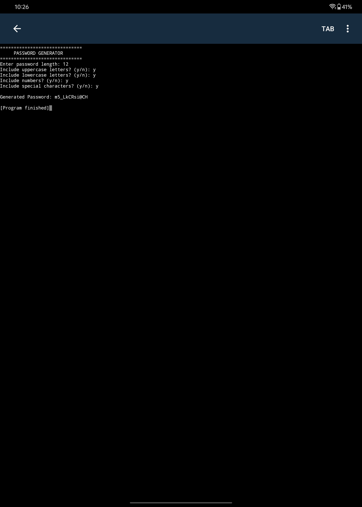

Password Generator

A simple Python project that generates random and secure passwords based on the user's selected preferences.
 Features
- Generate passwords of any length
- Include uppercase letters
- Include lowercase letters
- Include numbers
- Include special characters
- Simple and beginner-friendly Python program
 Technologies Used
- Python
- Random module
- String module
 How to Run
1. Download or clone this repository.
2. Make sure Python is installed on your computer.
3. Open the project folder in a terminal.
4. Run the following command:
```bash
##screeshot



